

  <h1 style="text-align: center;font-weight: bold">Praktikum 3 Mikrotik dan Sysadmin Cleaning System</h1>
  <h4 style="text-align: center;">Dosen Pengampu : Dr. Ferry Astika Saputra, S.T., M.Sc.</h4>

 

  
  <h3 style="text-align: center;">Disusun Oleh :  Kelompok 3</h3>
  

    <strong>Ade Hafis Rabbani (3122500001)</strong> 
    <strong>Nadila Aulya Salsabila Mirdianti (3122500002)</strong> 
    <strong>Gandi Rukmaning Ayu (3122500016)</strong>
  

  
  <h3 style="text-align: center;line-height: 1.5">Politeknik Elektronika Negeri Surabaya Departemen Teknik Informatika Dan Komputer Program Studi Teknik Informatika 2023/2024</h3>
  

## Daftar Isi

1. [Apa itu Mikrotik?](#1-apa-itu-mikrotik?-)
2. [Penjelasan](#2-buat-ringkasan-tentang-perbedaan-dari-debian-12-bookworm-dengan-debian-11-bullseye-versi-kernel-kebutuhan-sistem-penerapan-systemd-dan-perbedaan-packagenya-dalam-bentuk-tabel-)
3. [Penjelasan](#3-jelaskan-fungsi-dari-file-etcgroups-beserta-formatnya)

### 1. Apa itu Mikrotik?
**Pengertian Mikrotik**

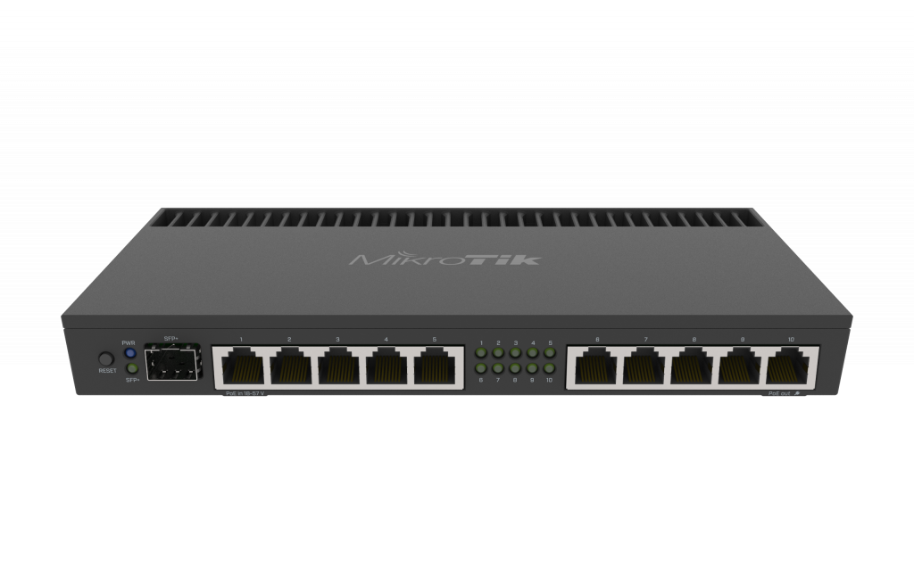

Mikrotik merupakan sebuah sistem operasi berbasis perangkat lunak (software) yang digunakan untuk mengubah komputer menjadi sebuah router dalam suatu jaringan. Menggunakan sistem operasi yang berbasis Linux dan menjadi dasar bagi router jaringan. Sistem operasi ini sangat ideal untuk mengelola administrasi jaringan komputer dengan berbagai skala, mulai dari kecil hingga besar.

Namun, masih banyak orang yang memiliki kesalahpahaman mengenai konsep Mikrotik dan router. Jika Mikrotik adalah suatu sistem operasi yang termasuk dalam kategori open source, maka router adalah perangkat keras yang berfungsi sebagai penghubung antara dua jaringan atau lebih. Jadi, perbedaan mendasar antara keduanya adalah bahwa Mikrotik adalah perangkat lunak (software) sedangkan router berperan sebagai perangkat keras (hardware).

### 2. Penjelasan
1. Buka aplikasi **Mikrotik**.

   

2. Step 2

   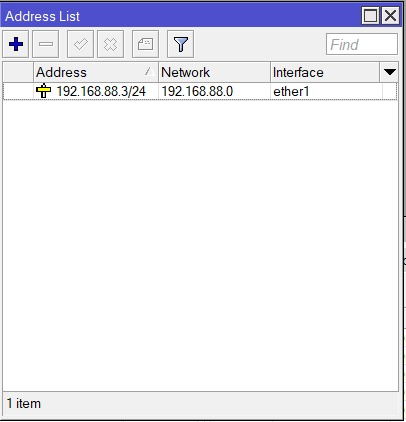

3. Step 3

   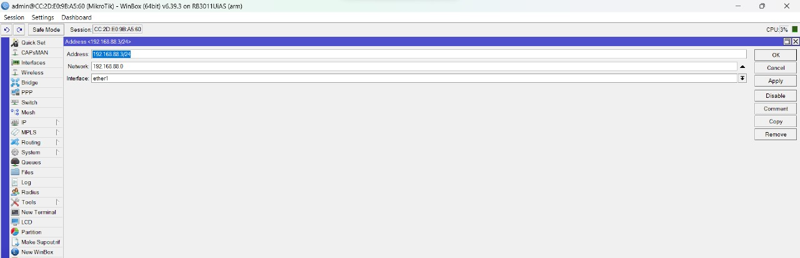

4. Step 4

   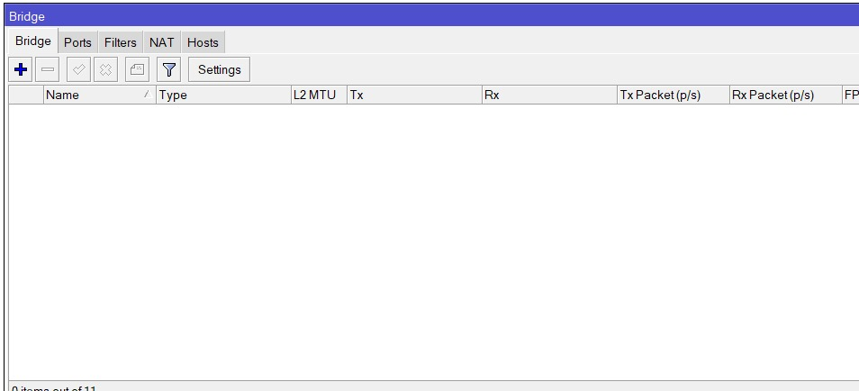

5. Step 5

   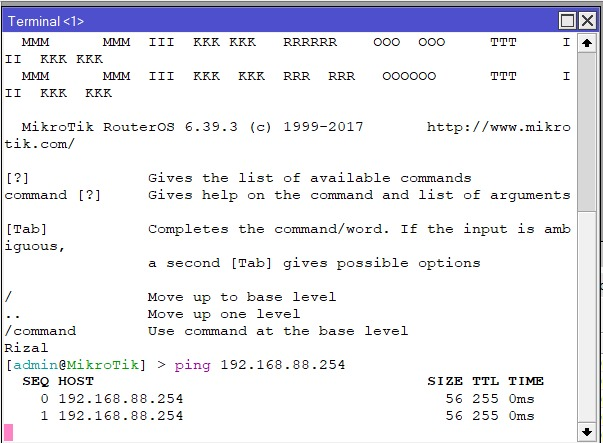

6. Step 6

   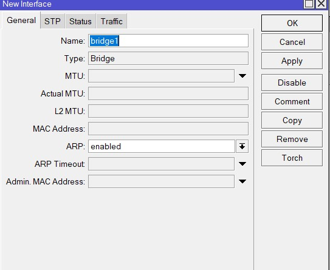

7. Step 7

   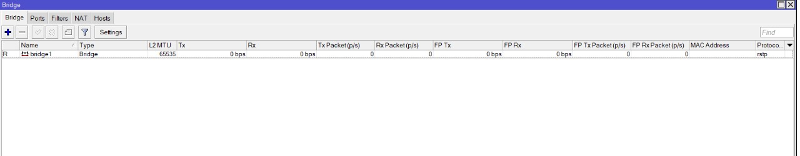

8. Step 8

   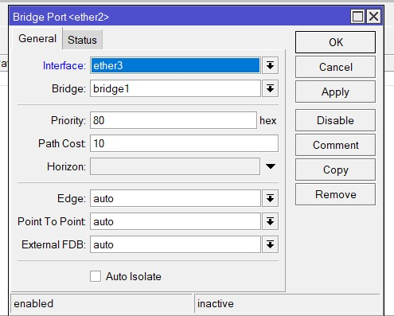

9. Step 9

   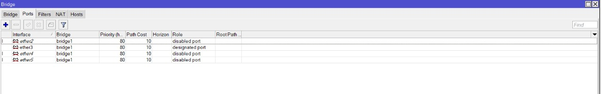

10. Step 10

    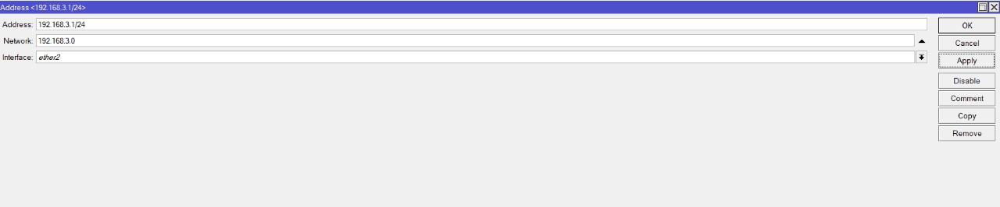

11. Step 11

    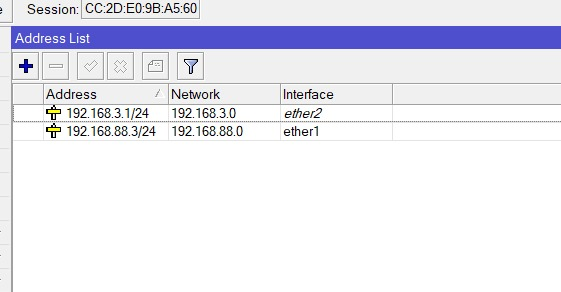

12. Step 12

    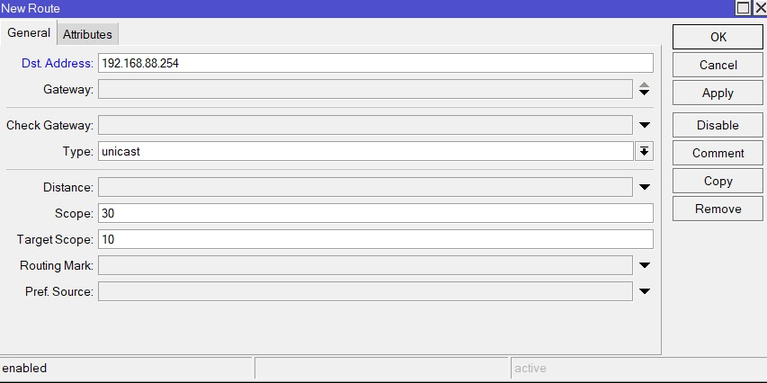

13. Step 13

    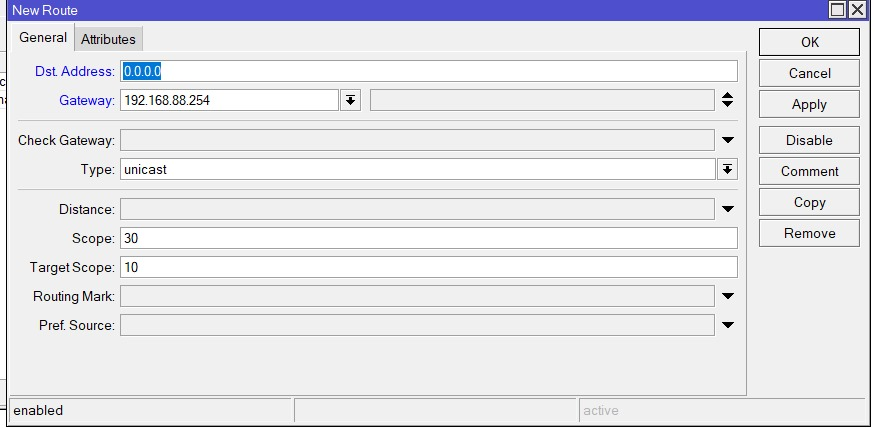

14. Step 14

    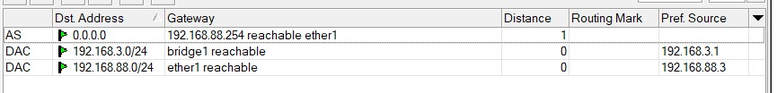

15. Step 15

    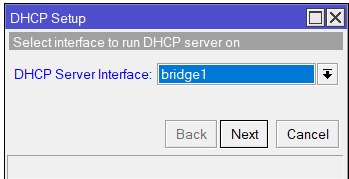

16. Step 16

    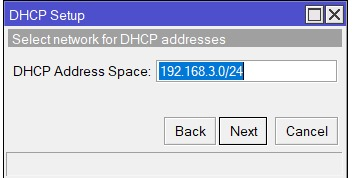

17. Step 17

    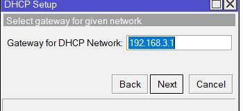

18. Step 18

    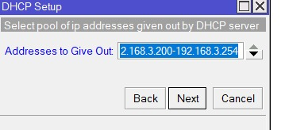

19. Step 19

    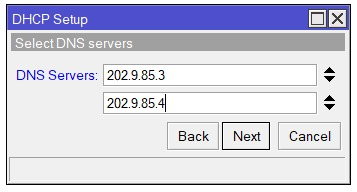

20. Step 20

    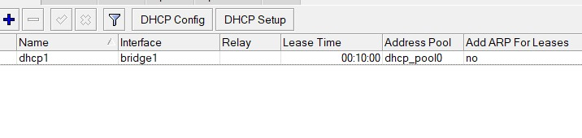

21. Step 21

    

22. Step 22

    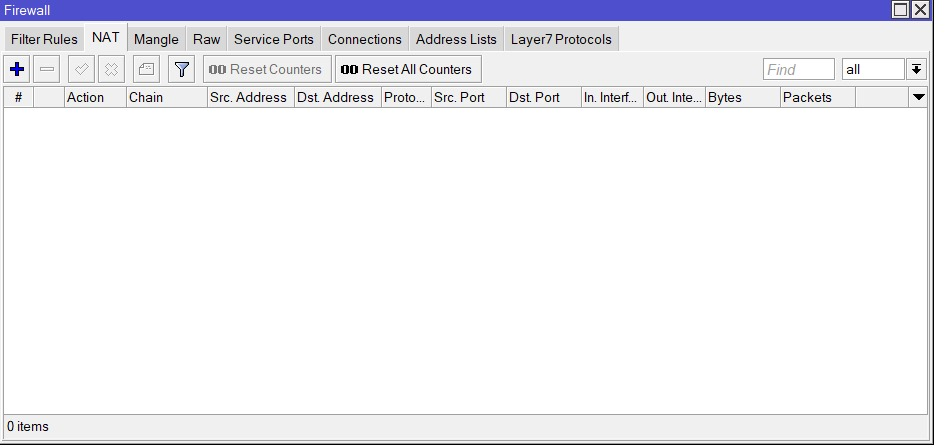

23. Step 23

    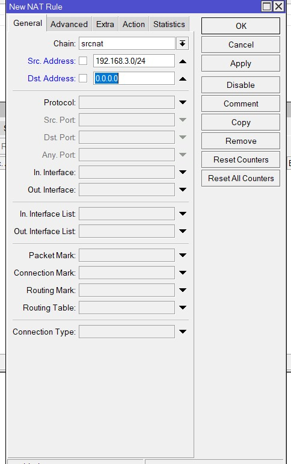

24. Step 24

    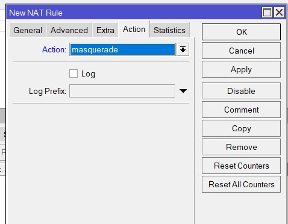
