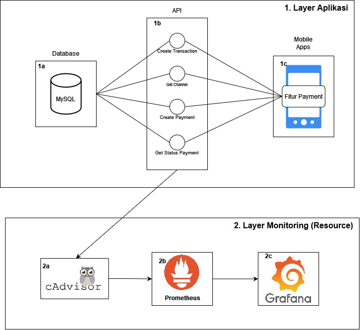
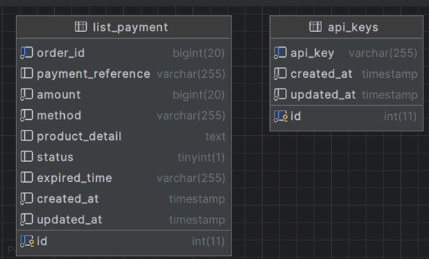
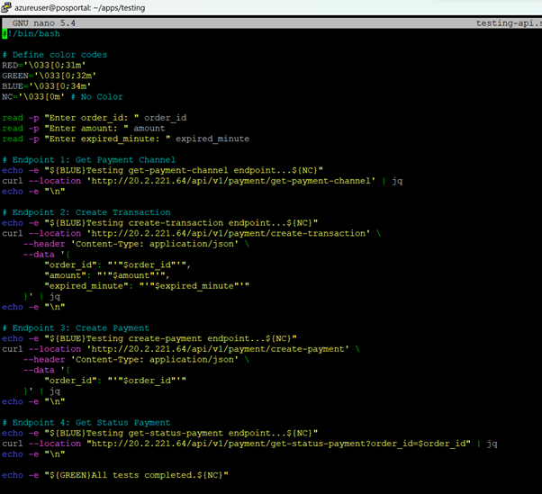
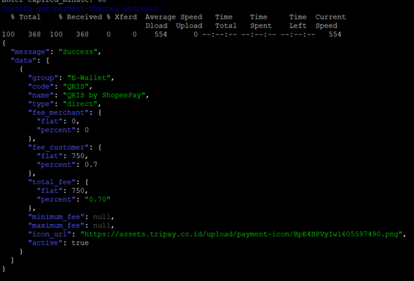
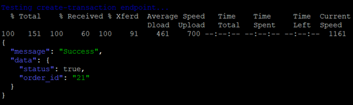
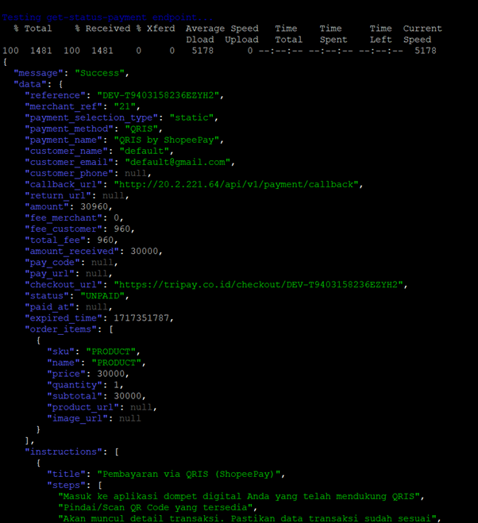
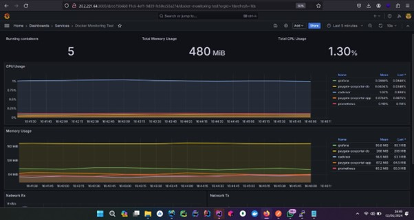

<div align="center">
  <h1 style="text-align: center;font-weight: bold">Project Charter Container Based App<br>
      Mobile Apps Point Of Sales (POS) with Payment Gateway</h1>
  <h4 style="text-align: center;">Dosen Pengampu : Dr. Ferry Astika Saputra, S.T., M.Sc.</h4>
</div>
<br />
<div align="center">
  
  <h3 style="text-align: center;">Disusun Oleh :</h3>
  <div style="align: center;">
    <table>
      <tr>
        <th>Nama</th>
        <th>NRP</th>
      </tr>
      <tr>
        <td>Ade Hafis Rabbani</td>
        <td>3122500001</td>
      </tr>
      <tr>
        <td>Nadila Aulya Salsabila Mirdianti</td>
        <td>3122500002</td>
      </tr>
      <tr>
        <td>Leody Zelvon Herliansa</td>
        <td>3122500010</td>
      </tr>
      <tr>
        <td>Akmal Zidani Fikri</td>
        <td>3122500019</td>
      </tr>
      <tr>
        <td>Bagus Bimo Prakoso</td>
        <td>3122500028</td>
      </tr>
    </table>
  </div>
  <h3 style="text-align: center; line-height: 1.5;">
    Politeknik Elektronika Negeri Surabaya<br>
    Departemen Teknik Informatika Dan Komputer<br>
    Program Studi Teknik Informatika<br>
    2023/2024
  </h3>
</div>

---

# Daftar Isi

<details>
  <summary>Daftar Isi</summary>
  <ol>
    <li>
      <a href="#pendahuluan">Pendahuluan</a>
      <ol>
        <li><a href="#latar-belakang">Latar Belakang</a></li>
        <li><a href="#pemanfaatan-teknologi">Pemanfaatan Teknologi</a></li>
      </ol>
    </li>
    <li>
      <a href="#ruang-lingkup">Ruang Lingkup</a>
      <ol>
        <li><a href="#aplikasi">Aplikasi</a></li>
        <li><a href="#monitoring-system">Monitoring System</a></li>
      </ol>
    </li>
    <li>
      <a href="#desain-sistem">Desain Sistem</a>
      <ol>
        <li><a href="#desain-sistem">Desain Sistem</a></li>
        <li><a href="#penjelasan">Penjelasan</a></li>
      </ol>
    </li>
    <li>
      <a href="#tugas-tim">Tugas Tim</a>
      <ol>
        <li><a href="#role">Role</a></li>
        <li><a href="#pembagian-tugas">Pembagian Tugas</a></li>
      </ol>
    </li>
    <li>
      <a href="#tahap-pelaksanaan">Tahap Pelaksanaan</a>
      <ol>
        <li><a href="#perencanaan">Perencanaan</a></li>
        <li><a href="#desain">Desain</a></li>
        <li><a href="#pengembangan">Pengembangan</a></li>
        <li><a href="#pengujian">Pengujian</a></li>
        <li><a href="#implementasi">Implementasi</a></li>
        <li><a href="#pemeliharaan-dan-optimalisasi">Pemeliharaan dan Optimalisasi</a></li>
      </ol>
    </li>
    <li><a href="#implementasi">Implementasi</a></li>
    <li><a href="#sistem-pengujian">Sistem Pengujian</a></li>
    <li><a href="#kesimpulan">Kesimpulan</a></li>
    <li><a href="#daftar-pustaka">Daftar Pustaka</a></li>
  </ol>
</details>

---

# Pendahuluan
   1. ## Latar Belakang
        Proyek ini bertujuan untuk mengembangkan aplikasi mobile Point of Sales (POS) yang bertujuan untuk membantu pengguna dalam mengelola transaksi penjualan pada bisnis mereka dengan efisien.
       
        Aplikasi ini akan menyediakan fitur-fitur seperti manajemen stok barang, pembayaran, pelaporan penjualan, dan integrasi dengan payment gateway untuk memudahkan pembayaran elektronik. 
       
        Aplikasi ini dirancang untuk membantu toko ritel, kafe, restoran, dan jenis usaha lainnya dalam meningkatkan efisiensi operasional, mengurangi kesalahan manual, dan menyediakan data penjualan secara real-time.

   2. ## Pemanfaatan Teknologi
      Dalam membangun proyek ini, kami menggunakan beberapa teknologi yang menunjang pengembangan dan operasi aplikasi ini, yaitu:
      1. ### Express.js

         **Express.js** adalah sebuah framework aplikasi web Node.js yang minimal dan fleksibel, cocok untuk membangun backend server dalam aplikasi mobile. Dengan Express.js, pengembang dapat dengan mudah membuat API yang diperlukan untuk aplikasi mobile, menangani permintaan HTTP, dan mengelola respons dari server.
      
         Dalam proyek aplikasi mobile ini, Express.js akan digunakan untuk:
         - **Membuat API Backend**: Mengatur endpoint untuk berkomunikasi dengan aplikasi mobile.
         - **Menangani Permintaan**: Mengelola permintaan dari aplikasi mobile dan memberikan respons yang sesuai.
         - **Integrasi dengan Database**: Berinteraksi dengan database MySQL untuk mengambil dan menyimpan data yang diperlukan oleh aplikasi mobile.

      2. ### MySQL

         **MySQL** adalah sistem manajemen basis data relasional (RDBMS) yang akan digunakan untuk menyimpan dan mengelola data dalam proyek aplikasi mobile ini. MySQL merupakan pilihan yang ideal untuk aplikasi mobile karena kemampuannya dalam menyediakan penyimpanan data yang terstruktur dan handal. 
      
         Dalam proyek ini, MySQL akan digunakan untuk:
         - **Penyimpanan Data Transaksi**: Menyimpan detail transaksi penjualan yang dilakukan melalui aplikasi mobile.
         - **Manajemen Inventaris**: Menyimpan informasi tentang produk, stok, dan harga.

      3. ### Payment Gateway Integration

         **Integrasi _Payment Gateway_** memungkinkan aplikasi mobile untuk menerima pembayaran online dari pengguna melalui berbagai metode pembayaran elektronik seperti kartu kredit, e-wallet, dan transfer bank.
      
         Dalam proyek ini, integrasi payment gateway akan mencakup:
         - **Pemrosesan Pembayaran**: Memungkinkan pengguna untuk melakukan pembayaran melalui aplikasi mobile menggunakan metode pembayaran yang disediakan.
         - **Konfirmasi Pembayaran**: Memastikan bahwa pembayaran berhasil dan mengirimkan konfirmasi pembayaran kepada pengguna.

      4. ### Docker

         **Docker** adalah platform yang akan digunakan untuk mengembangkan, menguji, dan menjalankan aplikasi mobile dalam lingkungan yang terisolasi dan konsisten.
      
         Dalam proyek ini, Docker akan digunakan untuk:
         - **Uji Coba Aplikasi**: Memastikan bahwa aplikasi berjalan dengan baik dalam lingkungan yang terisolasi sebelum di deploy ke lingkungan produksi.
         - **Deploy Aplikasi**: Memudahkan proses deploy aplikasi mobile ke server produksi dengan memastikan bahwa semua dependensi terpenuhi dan lingkungan berjalan dengan baik.
      
      5. ## Prometheus
      
         **Prometheus** adalah sistem monitoring dan alerting yang akan digunakan untuk memantau performa aplikasi dan mengumpulkan metrik dari berbagai komponen sistem. Dengan Prometheus, tim pengembang dapat memantau kinerja aplikasi secara real-time, mengidentifikasi masalah, dan mengambil tindakan yang diperlukan untuk memperbaiki performa aplikasi. 
         
         Dalam proyek ini, Docker akan digunakan untuk:
         - **Monitoring Performa**: Memantau performa aplikasi, server, dan database untuk mengidentifikasi masalah dan memperbaiki performa.
         - **Logging**: Mengumpulkan log aktivitas aplikasi dan server untuk analisis dan pemecahan masalah.
      
      6. ## Grafana 
      
         **Grafana** adalah platform visualisasi data yang akan digunakan untuk membuat dashboard dan grafik yang menampilkan metrik dan data dari Prometheus. Dengan Grafana, tim pengembang dapat membuat visualisasi data yang informatif dan mudah dimengerti, sehingga memudahkan dalam memantau performa aplikasi dan mengambil tindakan yang diperlukan.
         Dalam proyek ini, Grafana akan digunakan untuk:
      
         - **Visualisasi Data**: Membuat dashboard dan grafik yang menampilkan metrik performa aplikasi dan server.
         - **Monitoring Real-Time**: Menampilkan data performa aplikasi secara real-time untuk memantau kinerja aplikasi.

      7. ## cAdvisor
         cAdvisor adalah alat yang akan digunakan untuk memantau performa aplikasi dan mengumpulkan metrik dari berbagai komponen sistem. Dengan C Advisor, tim pengembang dapat memantau kinerja aplikasi secara real-time, mengidentifikasi masalah, dan mengambil tindakan yang diperlukan untuk memperbaiki performa.
         Dalam proyek ini, cAdvisor akan digunakan untuk:
         - **Pemantauan Penggunaan CPU dan Memori**: Mengumpulkan data tentang penggunaan CPU dan memori dari setiap container Docker yang menjalankan komponen aplikasi. Hal ini membantu dalam mengidentifikasi bottleneck dan mengoptimalkan penggunaan sumber daya.
         - **Integrasi dengan Prometheus**: Mengumpulkan metrik dari cAdvisor dan mengirimkannya ke Prometheus untuk penyimpanan dan analisis lebih lanjut. Ini memungkinkan visualisasi dan pelaporan yang lebih baik melalui Grafana.
 

# Ruang Lingkup
   1. ## Aplikasi 
      1. Database
            - **Penyimpanan Data Transaksi**: Menyimpan detail transaksi penjualan termasuk waktu, item, harga, dan metode pembayaran.
            - **Manajemen Inventaris**: Menyimpan data produk, termasuk stok, harga, dan deskripsi.
            - **Data Pengguna dan Hak Akses**: Menyimpan informasi pengguna termasuk peran, hak akses, dan PIN untuk otentikasi pengguna di aplikasi mobile.
      2. Server
         - **API Backend**: Menggunakan Express.js untuk mengelola permintaan dan pengolahan data.
         - **Integrasi Payment Gateway (Tripay)**: Mengelola pemrosesan pembayaran melalui metode QRIS.
         - **Manajemen Sesi dan Autentikasi**: Menggunakan middleware untuk autentikasi dan otorisasi pengguna.
         - **Logging dan Error Handling**: Middleware untuk logging aktivitas dan penanganan kesalahan.
      3. Mobile Apps
         - **Aplikasi User-Friendly**: Aplikasi mobile untuk kasir dan manajemen yang mudah digunakan.
         - **Transaksi Penjualan**: Fitur untuk melakukan dan mencatat transaksi penjualan.
         - **Pelaporan Penjualan**: Menyediakan laporan penjualan mingguan, bulanan, dan tahunan.
         - **Fitur Tambahan**: 
            - Scan barcode
            - Edit struk
            - Pengelolaan pengguna
            - Penggunaan PIN untuk otorisasi akses.
   2. ## Monitoring System
      1. **cAdvisor** : Untuk memantau performa aplikasi dan mengumpulkan metrik dari berbagai komponen sistem
      2. **Prometheus** : Untuk monitoring performa aplikasi dan mengumpulkan metrik dari berbagai komponen sistem
      3. **Grafana** : Untuk visualisasi data dan metrik yang dikumpulkan oleh Prometheus.

# DESAIN SISTEM
   1. ## Desain Sistem
      

   2. ## Penjelasan
        1. **Layer 1 : Aplikasi** <br>
           Diagram di atas menunjukkan bagaimana komponen-komponen utama aplikasi akan dikemas ke dalam container Docker. Setiap container akan berisi satu komponen aplikasi, seperti database, aplikasi backend, dan aplikasi mobile sebagai _client_.
        2. **Layer 2 : Monitoring** <br> 
           Layer ini menunjukkan bagaimana komponen monitoring system akan diintegrasikan ke dalam arsitektur aplikasi. cAdvisor akan digunakan untuk memantau performa aplikasi dan mengumpulkan metrik dari berbagai komponen sistem. Prometheus akan digunakan untuk memantau performa aplikasi dan mengumpulkan metrik dari berbagai komponen sistem. Grafana akan digunakan untuk visualisasi data dan metrik yang dikumpulkan oleh Prometheus.
      
# Tugas Tim
   1. ## Role
      1. **UI/UX Designer**
            - **Nama :**
              1. Nadila Aulya Salsabila Mirdianti
            - **Tugas :**
               1. Membuat wireframe dan prototype. 
               2. Mendesain antarmuka dan pengalaman pengguna untuk aplikasi mobile
               3. Melakukan user testing dan iterasi desain berdasarkan feedback.
      2. **Backend Developer**
         - **Nama :**
           1. Ade Hafis Rabbani
         - **Tugas :**
           1. Mengembangkan dan memelihara API menggunakan Express.js, serta mengintegrasikan payment gateway. 
           2. Merancang API endpoint untuk transaksi.
      3. **Mobile Developer**
         - **Nama :**
           1. Akmal Zidani Fikri
           2. Bagus Bimo Prakoso
         - **Tugas :**
           1. Mengembangkan aplikasi mobile yang user-friendly untuk Android dan iOS. 
           2. Mengimplementasikan fitur scan barcode.
      4. **Database Administrator**
         - **Nama :**
           1. Leody Zelvon Herliansa
         - **Tugas :**
           1. Merancang skema database MySQL untuk menyimpan data transaksi, inventaris, dan informasi pengguna. 
           2. Mengelola database dan melakukan backup secara berkala.
           
   2. ## Pembagian Tugas 
      1. Aplikasi Mobile 
         1. Deployment MySQL Database
            - **Nama : Leody Zelvon Herliansa**
            - **Tugas dan Kewajiban :**
                1. Setup environment MySQL 
                2. Membuat skema database
              
         2. Deployment API 
             - **Nama : Bagus Bimo Prakoso**
             - **Tugas dan Kewajiban :**
                1. API Development 
                2. Containarization API
                3. Configuration Management
                4. API Testing
               
         3. Implementasi Endpoint API kedalam Fitur
             - **Nama : Nadila Aulya Salsabila Mirdianti**
             - **Tugas dan Kewajiban :**
                1. Integrasi fitur 
                2. Error handling
                
      2. Monitoring System
         1. Deployment cAdvisor
             - **Nama : Ade Hafis Rabbani**
             - **Tugas dan Kewajiban :**
                1. Setup dan configuration
                2. Metrics collection
                3. Integration dengan Prometheus
         2. Deployment Prometheus
             - **Nama : Ade Hafis Rabbani**
             - **Tugas dan Kewajiban :**
                1. Setup dan configuration
                2. Metrics collection
                3. Integration dengan Grafana
         3. Deployment Grafana
             - **Nama : Akmal Zidani Fikri**
             - **Tugas dan Kewajiban :**
                1. Installation dan setup
                2. Dashboard creation
                3. Data source management
                4. Custom visualization

# Tahap Pelaksanaan
  
   1. ## Perencanaan
      - **Identifikasi Kebutuhan**: Menganalisis kebutuhan aplikasi dan menentukan fitur-fitur yang akan dikembangkan.
      - **Penjadwalan**: Menetapkan jadwal pengembangan, pengujian, dan implementasi aplikasi.
   2. ## Desain
      - **Rancangan Arsitektur**: Membuat rancangan arsitektur yang sesuai dengan prinsip-prinsip DevOps, mempertimbangkan skalabilitas, keamanan, dan fleksibilitas.
      - **Containerization Strategy**: Memutuskan strategi containerization dengan Docker dan menyiapkan Dockerfile untuk setiap komponen aplikasi.
   3. ## Pengembangan
      - **Pembangunan Backend**: Mengembangkan API backend menggunakan Express.js untuk mengelola permintaan dan pengolahan data.
      - **Pembuatan Aplikasi Mobile**: Membangun aplikasi mobile dengan fokus pada kenyamanan pengguna dan keamanan data.
      - **Integrasi Payment Gateway**: Mengintegrasikan payment gateway untuk memungkinkan transaksi pembayaran.
      - **Pengembangan Database**: Membuat skema database MySQL untuk menyimpan data transaksi, inventaris, dan informasi pengguna.
   4. ## Pengujian
      - **Pengujian Fungsional**: Memastikan bahwa semua fitur aplikasi berfungsi sesuai yang diharapkan.
      - **Pengujian Integrasi**: Menguji integrasi antara komponen-komponen aplikasi seperti server, database, dan aplikasi mobile.
      - **Pengujian Keamanan**: Melakukan pengujian keamanan untuk mengidentifikasi dan memperbaiki kerentanan yang ada.
   5. ## Deployment
      - **Deploy Container**: Menggunakan Docker untuk membangun container dan mendistribusikan aplikasi.
      - **Monitor dan Manajemen**: Memantau kinerja aplikasi secara terus-menerus dan melakukan manajemen ketika diperlukan.
   6. ## Pemeliharaan dan Optimalisasi
      - **Pemeliharaan Rutin**: Melakukan pemeliharaan rutin pada aplikasi dan infrastruktur.
      - **Optimalisasi Kinerja**: Mengidentifikasi area-area di mana kinerja aplikasi dapat ditingkatkan dan melakukan perbaikan yang diperlukan.

# Implementasi
   1. Aplikasi Mobile
      1. **Deployment MySQL Database**
         - **Nama : Leody Zelvon Herliansa**
         - **Tugas dan Kewajiban :**
            1. Setup environment MySQL
               - Instalasi dan konfigurasi Docker dan Docker Compose
               - Persiapan file 'docker-compose.yml' untuk MySQL Database
                 ```yaml
                    db:
                    image: mysql:5.7
                    container_name: paygate-posportal-db
                    environment:
                    MYSQL_ROOT_PASSWORD: devops1
                    MYSQL_DATABASE: db_pos_portal
                    MYSQL_USER: devopsadmin
                    MYSQL_PASSWORD: devops1
                    ports:
                    - "3306:3306"
                    networks:
                      - paygate-network
                    volumes:
                      - ./db.sql:/docker-entrypoint-initdb.d/db.sql
                      - db_data:/var/lib/mysql
                 ```

            2. Membuat skema database
               - Buat file 'db.sql' yang berisi skema database awal.
               - Skema mencakup semua tabel, indeks, dan constraint yang diperlukan.
                 

      2. **Deployment API**
         - **Nama : Bagus Bimo Prakoso**
         - **Tugas dan Kewajiban :**
            1. API Development
               - Membuat API endpoint untuk transaksi penjualan.
               - Menggunakan Express.js untuk membuat API backend sesuai dengan kebutuhan payment gateway.
            2. Containarization API
               - Membuat Dockerfile untuk mengemas API backend ke dalam container Docker.
               
                  ```yaml
                     WORKDIR /usr/src/app
                     COPY package*.json ./
                     RUN npm install
                     COPY . .
                     EXPOSE 5000
                     CMD ["npm", "start"]
                  ```
               - Menggunakan Docker Compose untuk mengelola container dan jaringan.
               
                  ```yaml
                     app:
                        build: .
                        container_name: paygate-posportal-app
                        environment:
                          - PORT=5000
                          - NODE_ENV=development
                          - APP_URL=http://localhost:5000
                          - APP_NAME=Paygate-PosPortal
                          - APP_VERSION=1.0.0
                          - APP_LENGTH_API_KEY=32
                          - APP_TIMEZONE=Asia/Jakarta
                          - MERCHANT_CODE=T9403
                          - MERCHANT_KEY=DEV-nOqEQ9h8bBUHRc4SvjH6OzGwHTPMsnOgK0JxzDq3
                          - PRIVATE_KEY=6EkU8-kHGQE-ZDWas-DPZgd-8wTMb
                          - SANDBOX=true
                          - DB_CONNECTION=mysql
                          - DB_HOST=db
                          - DB_PORT=3306
                          - DB_DATABASE=db_pos_portal
                          - DB_USERNAME=devopsadmin
                          - DB_PASSWORD=devops1
                        ports:
                          - "5000:5000"
                        depends_on:
                          - db
                        networks:
                          - paygate-network
                  ```
           3. Configuration Management
              - Mengelola konfigurasi API menggunakan environment variables.
              - Memisahkan konfigurasi untuk pengembangan, uji coba, dan produksi.
              
      3. **Implementasi Endpoint API kedalam Fitur**
         - **Nama : Nadila Aulya Salsabila Mirdianti**
         - **Tugas dan Kewajiban :**
            1. Integrasi fitur
               - Mengintegrasikan fitur-fitur aplikasi mobile dengan API backend.
               - Memastikan bahwa data transaksi tersedia dan dapat diakses melalui API.
            2. Error handling
               - Menangani kesalahan dan respons yang tidak diharapkan dari API.
               - Memberikan pesan kesalahan yang informatif dan membantu pengguna dalam menavigasi aplikasi.
            3. API Testing
               - Melakukan pengujian API menggunakan Postman.
               - Memastikan bahwa API berfungsi dengan baik dan memberikan respons yang sesuai.
               
   2. Monitoring System
      1. **Deployment cAdvisor**
         - **Nama : Ade Hafis Rabbani**
         - **Tugas dan Kewajiban :**
            1. Setup dan configuration
               - Instalasi cAdvisor pada server yang sama dengan aplikasi untuk memantau container Docker.
               - Konfigurasi cAdvisor untuk memantau performa aplikasi dan mengumpulkan metrik.
            2. Metrics collection
               - Mengumpulkan metrik performa aplikasi seperti penggunaan CPU, memori, dan disk.
               - Menyimpan metrik dalam format yang dapat diakses oleh Prometheus.
            3. Integration dengan Prometheus
               - Mengintegrasikan cAdvisor dengan Prometheus untuk memantau performa aplikasi secara real-time.
               
      2. **Deployment Prometheus**
         - **Nama : Ade Hafis Rabbani**
         - **Tugas dan Kewajiban :**
            1. Setup dan configuration
               - Instalasi Prometheus pada server yang sama dengan aplikasi untuk memantau performa aplikasi.
               - Konfigurasi Prometheus untuk mengumpulkan metrik dari cAdvisor dan aplikasi.
            2. Metrics collection
               - Mengumpulkan metrik performa aplikasi seperti penggunaan CPU, memori, dan disk.
               - Menyimpan metrik dalam format yang dapat diakses oleh Grafana.
            3. Integration dengan Grafana
               - Konfigurasi Grafana untuk visualisasi metrik yang dikumpulkan oleh Prometheus.
               
      3. **Deployment Grafana**
         - **Nama : Akmal Zidani Fikri**
         - **Tugas dan Kewajiban :**
            1. Installation dan setup
               - Instalasi Grafana pada server yang sama dengan aplikasi untuk visualisasi metrik.
               - Konfigurasi Grafana untuk mengakses metrik dari Prometheus.
            2. Data source management
               - Mengelola data source dari Prometheus untuk mengakses metrik performa aplikasi.
               - Memastikan bahwa data source terhubung dengan benar dan dapat diakses oleh Grafana.
            3. Custom visualization
               - Membuat visualisasi kustom untuk metrik performa aplikasi.
               - Menyesuaikan tata letak dan warna grafik untuk meningkatkan keterbacaan dan pemahaman.

# Sistem Pengujian
   Pengujian aplikasi menggunakan metode cURL untuk melakukan request ke API backend dan memastikan bahwa respons sesuai dengan yang diharapkan. Pengujian dilakukan pada fitur integrasi payment gateway.
   1. **Pengujian Application Layer** 
      1. Buat file `testing-api.sh` berisi script cURL untuk melakukan request ke API backend. 
         
      
      2. Jalankan pengujian untuk melihat apakah API memberikan respons yang sesuai.
      
         1. **GET Payment Channel**
         
            HTTP Method : GET <br>
            Header      : ```Accept: application/json``` <br>
            Endpoint    : ```/api/v1/payment/get-payment-channel``` <br>
            
            
         2. **CREATE Transaction**
         
            HTTP Method : POST <br>
            Header      : ```Accept: application/json``` <br>
            Endpoint    : ```/api/v1/payment/create-transaction``` <br>
            
         
         3. **CREATE Payment**
         
            HTTP Method : POST <br>
            Header      : ```Accept: application/json``` <br>
            Endpoint    : ```/api/v1/payment/create-payment``` <br>
            
         
         4. **GET Status Payment**
         
            HTTP Method : GET <br>
            Header      : ```Accept: application/json``` <br>
            Endpoint    : ```/api/v1/payment/get-status-payment?order_id=$order_id``` <br>
            
         
      3. **Pengujian Webhook**
         Karena aplikasi tidak hanya api tetapi ada webhook maka dilakukan pengujian dengan cara melakukan simulasi pembayaran dari provider payment gateway yang dipakai (tripay).
      
         
         
   2. **Pengujian Monitoring Layer**

      Layer monitoring diuji dengan cara memantau performa aplikasi dan mengumpulkan metrik dari berbagai komponen sistem. Pengujian dilakukan pada fitur cAdvisor, Prometheus, dan Grafana.

      

      Berhasil mendapatkan data dari prometheus dengan exporter cAdvisor untuk mendapatkan statistik penggunaan CPU,RAM,Network transmitter dan network receiver

# Kesimpulan
   Proyek ini bertujuan untuk mengembangkan aplikasi mobile Point of Sales (POS) yang memungkinkan pengguna untuk mengelola transaksi penjualan dengan efisien. Aplikasi ini menyediakan fitur-fitur seperti manajemen stok barang, pembayaran, pelaporan penjualan, dan integrasi dengan payment gateway. Proyek ini melibatkan pengembang backend, pengembang mobile, dan administrator database untuk mengembangkan dan memelihara aplikasi. Selain itu, proyek ini juga melibatkan tim monitoring system untuk memantau performa aplikasi dan mengumpulkan metrik dari berbagai komponen sistem. Proyek ini melibatkan beberapa teknologi seperti Express.js, MySQL, Docker, Prometheus, Grafana, dan cAdvisor untuk mengembangkan dan mengoperasikan aplikasi. Proyek ini diharapkan dapat membantu bisnis dalam meningkatkan efisiensi operasional, mengurangi kesalahan manual, dan menyediakan data penjualan secara real-time.
   