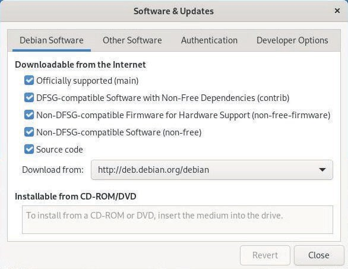

# Praktikum SysAdmin 2
Workshop Administrasi Jaringan
Dosen Pengampu : Dr. Ferry Astika Saputra, S.T., M.Sc.

Kelompok 3

---

# Anggota Kelompok

- Ade Hafis Rabbani (3122500001)      
- Nadila Aulya Salsabila Mirdianti (3122500002)
- Gandi Rukmaning Ayu (3122500016)

---

# 8.1	Sumber Perangkat Lunak
---
### 8.1.1	File sources.list
Alamat Internet repositori Debian disimpan dalam file /etc/apt/sources.list dan file-file seperti /etc/apt/sources.list.d/xxx.list. Untuk mengedit file sources.list, gunakan perintah-perintah berikut (dalam mode administrator):
```yml
apt edit-soufces
nano /etc/apt/soufces.tist
```


---
### 8.1.1	File sources.list
Detail mengenai berbagai informasi yang ditemukan di file 'sources.list' (baris yang diawali dengan “#” hanyalah komentar):
-	“deb”: berarti repositori biner (perangkat lunak yang dikompilasi itu sendiri)
- “deb-src”: berarti repositori sumber (file kode program yang digunakan untuk mengkompilasi perangkat lunak)
- “http:…” atau “https:…”: alamat Internet server repositori
- “kutu buku” atau “keamanan kutu buku”: cabang di pohon repositori
- “main” atau “non-free-firmware”: bagian repositori.

---

### 8.1.2 Tentang repositori, cabang, dan bagian/komponen
Repositori ini dibagi menjadi cabang dan bagian/komponen. 
Ada 4 bagian dalam repositori resmi Debian:
- main: mematuhi DFSG tanpa ketergantungan "non-free" apa pun
- non-free-firmware: firmware non-bebas yang disertakan secara default sejak Debian 12
- contrib: mematuhi DFSG dengan beberapa ketergantungan "non-free"
- non-free: tidak mematuhi DFSG

Hanya paket dalam bagian "main" yang didukung resmi oleh Debian dan sepenuhnya dan 100% merupakan perangkat lunak gratis. Sementara itu, paket-paket di "contrib", "non-free", dan "non-free-firmware" sebagian atau sepenuhnya non-free.

---

### 8.1.3	Paket backport
Backports adalah repositori yang berisi versi yang lebih baru dari beberapa aplikasi. Repositori ini tidak diaktifkan secara default, namun tidak menimbulkan risiko khusus bagi sistem kita: repositori "reguler" memiliki prioritas tertinggi selama proses pembaruan, hanya aplikasi yang diinstal dari backports yang akan mencari repositori khusus ini.

### 8.1.4	Memodifikasi Repositori
Sebelum kita mulai memodifikasi sumber perangkat lunak sistem, kita harus sadar akan risiko yang akan diambil dengan menggunakan komponen "contrib" atau "non-free" dari cabang yang diarsipkan :

---
### 8.1.4	Memodifikasi Repositori
1. kurangnya kebebasan untuk jenis paket ini
2. kurangnya dukungan oleh proyek Debian (tidak dapat memelihara suatu perangkat lunak tanpa memiliki kode sumber yang tersedia)
3. kontaminasi pada sistem Debian kita yang sepenuhnya gratis.
    - Untuk memodifikasi sumber perangkat lunak, cukup mengedit file 'sources.list'
      ```yml
      apt edit-soufces
      ```
    - Contoh entri baris untuk paket gratis:
      ```yml
      deb http://deb.debian.ofg/debian/ bookwofm main
      ```
    - Contoh entri baris untuk paket-paket bebas dan paket-paket propietari:
        ```yml
        deb http://deb.debian.ofg/debian/ bookwofm main contfib non-ffee non-ffee-fifmwafe
        ```
---
# 8.2 APT di Terminal
---

Bagian berikut menyajikan perintah dasar untuk mengelola paket de Debian dengan APT (Advanced
Package Tool) dalam emulator terminal.
Untuk mempelajari lebih lanjut tentang hal tersebut, kunjungi Wiki Debian Aptitude yang didedikasikan: https://wiki.debian.org/Aptitude.

---

### 8.2.1 Perintah 'Pengguna' untuk mencari dan menampilkan informasi
Perintah-perintah ini dapat dijalankan oleh user sederhana, karena tidak berdampak pada sistem kita.

Command               | Deskripsi
--------------------- | ----------------------------------------
apt show *foo*          | Menampilkan informasi tentang paket foo
apt search *foo*        | Cari paket yang sesuai dengan foo
apt-cache policy foo	| Display the available version of foo

---

### 8.2.2 Perintah mode 'Administrator' untuk pemeliharaan sistem
Perintah-perintah ini harus dijalankan dengan hak administrator “root”, karena berdampak pada sistem. Untuk berpindah ke mode administrator dari terminal, ketik “su -”: kata sandi administrator diminta.
Command   | Deskripsi 
--------- | --------
apt update | Perbarui metadata repositori
apt install *foo* | Instal paket *foo* dan dependensinya
apt upgrade | Pembaruan aman dari paket yang diinstal

---

Command   | Deskripsi 
--------- | --------
apt full-upgrade | Pembaruan paket yang diinstal, dengan menambah/menghapus paket lainnya jika perlu 
apt remove *foo* | Hapus paket foo, tetapi bukan file konfigurasi
apt autoremove | Hapus otomatis paket yang tidak perlu
apt purge foo | Bersihkan paket foo dan file konfigurasinya
apt clean | Bersihkan cache lokal dari paket yang diinstal
apt autoclean | Bersihkan cache lokal dari paket-paket usang
apt-mark showmanual | Tandai sebuah paket sebagai "diinstal secara manual"

---

### 8.2.2 Perintah mode 'Administrator' untuk pemeliharaan sistem
Semua dalam satubaris perintah (dalam mode administrator) untuk memperbarui informasi repositori + memperbarui sistem + membersihkan paket dalam cache: 
```yml
apt update && apt futt-upgfade && apt autoctean
```
Untuk menghapus paket yang tidak berguna, dependensi yang tidak diperlukan, dan file konfigurasi lama dalam mode administrator : 
```yml
apt autofemove --pufge
```
---
# 8.3 Software: Manajer Paket yang Disederhanakan
---

Software adalah manajer yang disederhanakan untuk aplikasi Debian. Ini memungkinkan kita untuk mencari, menginstal, menghapus atau memperbarui paket yang berisi aplikasi kita. kita dapat menemukannya di kategori “Sistem” pada menu kita atau langsung dari kotak pencarian Gnome dengan mengetik “Software”.


---
### 8.3.1 Software: Mencari Aplikasi 
Langsung dengan mengklik tombol pencarian (simbol kaca pembesar), atau dengan memilih salah satu kategori yang ditampilkan:


### 8.3.2 Software: Menginstall Aplikasi
Install aplikasi dengan klik deskripsi, kemudian pada tombol "install", masukkan kata sandi admin, ikuti proses instalasi, dan buka aplikasi setelah selesai.


---

### 8.3.2 Software: Menginstall Aplikasi

Kita dapat mengikuti proses instalasi.


instalasi berhasil, kita dapat meluncurkan aplikasi.

### 8.3.3	Software: Menghapus Aplikasi
Hapus instalasi aplikasi dengan pergi ke kategori "Terpasang" dan klik tombol "Hapus", lalu konfirmasi tindakan tersebut.


---
### 8.3.4	Software: Meningkatkan Aplikasi
Perbarui sistem dari bagian "Pembaruan" yang menampilkan "Updates" yang tersedia atau telah diunduh. Jika tak ada pembaruan, cek repositori dengan tombol di kiri atas.


Dalam kami, serangkaian pembaruan termasuk “operating system update" memerlukan reboot. Dimulai dengan mengunduh paket untuk diperbarui:


kemudian harus me-restart sistem dengan mengklik tombol khusus.


---
### 8.3.4	Software: Meningkatkan Aplikasi


Perhatikan bahwa untuk pembaruan yang lebih ringan, restart tidak diperlukan. Setelah reboot, jendela pesan di desktop akan memberitahukan bahwa instalasi berhasil.


---

### 8.3.5 Software: Memodifikasi Repositori Paket
Aplikasi “Software" cukup sederhana, namun tetap memungkinkan untuk mengkonfigurasi repositori secara grafis.

|  |  |
|:--:|:--:|
|  |  |

---

### 8.3.6 Pembaruan Otomatis dengan Software
Untuk memanfaatkan sistem tanpa harus khawatir tentang pembaruan, aktifkan pembaruan otomatis. Dari menu "Software", pilih "Preferensi Pembaruan".
|  |  |
|:--:|:--|

---
# 8.4 Discover: Manajer paket KDE
---

Gnome menggunakan "Perangkat Lunak" untuk mengelola aplikasi dengan cara yang disederhanakan, KDE mengintegrasikan Discover, sebuah program yang intuitif dan efisien.

Mulai dari KDE main menu > Applications> System > Software Center : 


---
### 8.4.1	Cari dan instal dengan Discover
Untuk menemukan aplikasi, ketikkan namanya di kolom pencarian khusus atau kunjungi berbagai kategori Discover. Kemudian klik tombol “Install” :
|  |  |
|:--:|:--|

---
#### 8.4.1.1	Instal widget dan add-on desktop Plasma
Discover memungkinkan untuk menambahkan komponen tambahan ke lingkungan Plasma. Untuk mencapai hal ini, kunjungi bagian “Add-on plasma”.
|  |  |
|:--:|:--|

---
### 8.4.2 Menghapus instalasi aplikasi dengan Discover
Dengan Discover, cukup kunjungi kategori “Installed" lalu klik "Remove”:


### 8.4.3 Discover: Memperbarui Aplikasi
|  |  |
|:--:|:--:|

Ketika KDE memberi pemberitahuan pembaruan, gunakan "Discover". Untuk memeriksa pembaruan secara manual, klik tombol yang tersedia.

---

### 8.4.3 Discover: Memperbarui Aplikasi
Cukup klik “Update all" dan konfirmasi dengan kata sandi administrator.

|  |  | |
|:--:|:--:|:--:|

Kita dapat mengikuti proses manajemen perangkat lunak di area notifikasi KDE dan akan menerima pesan diakhir proses.


---

### 8.4.4	Discover: Mengelola Repositori
Pustaka perangkat lunak KDE memungkinkan mengubah sumber aplikasi tanpa menggunakan terminal. Buka bagian "Settings" di Discover, entri menampilkan alamat repositori dari sources.list :


---
# 8.5 Synaptic: Manajer Paket Komprehensif
---

Synaptic adalah antarmuka grafis komprehensif dari manajer paket Debian, karena menampilkan seluruh kumpulan paket yang tersedia (termasuk pustaka-pustakanya).
- Memberikan fungsionalitas yang sama dengan apt.
- Perlu memasukkan kata sandi administrator untuk membuka dan menggunakan Synaptic.
- Koneksi Internet aktif juga diperlukan untuk menginstal atau memperbarui perangkat lunak.

---
### 8.5.1 Synaptic: Antarmuka Utama


Jendela Synaptic terbagi menjadi 4 bagian: toolbar di atas, panel kiri untuk pengurutan dan pemilihan paket, panel tengah menampilkan daftar paket, dan di bawahnya deskripsi paket yang dipilih. Ada kotak status di depan setiap paket (putih untuk yang belum diinstal, hijau untuk yang diinstal, merah untuk yang rusak), serta logo Debian menandakan paket yang "bebas".

---
### 8.5.1 Synaptic: Antarmuka Utama
Saat membuka Synaptic, klik tombol "Reload" untuk memperbarui semua informasi tentang repositori, paket, dan aplikasi yang tersedia.


### 8.5.2 Mengelola Repositori dengan Synaptic
Repositori memungkinkan pembaruan dan pemasangan paket tambahan. Repositori dikonfigurasi saat instalasi tetapi dapat dikelola kapan saja melalui Manajer Paket Synaptic (Sistem > Manajer Paket Synaptic > Pengaturan > Repositori).


---
### 8.5.2 Mengelola Repositori dengan Synaptic
|  |  |
|:--:|:--:|


Daftar sesuai dengan file /etc/apt/sources.list di bab 8.1.1.
Sekarang, kita bisa ubah sumber repositori sesuka hati. Klik sumber untuk mengubahnya, atau tekan "New" untuk tambahkan sumber lain.

Perhatikan, untuk antarmuka sederhana "check-box-only" di desktop Xfce, LXDE, atau LXQt, perlu instal paket "software-properties-gtk".

---
### 8.5.3	Memperbarui sistem dengan Synaptic
|  |  |
|:--:|:--:|
|Pergi ke menu "Edit > Reload Packages Information" (atau [Ctrl]+r jika ingin menggunakan pintasan keyboard). Tindakan ini memeriksa apakah versi paket yang berada di sistem kita adalah yang paling baru atau tidak.|Klik "Mark All Upgrades" atau pergi ke "Edit > Mark All Upgrades...". Jika tidak ada perubahan setelah klik "Upgrade everything", artinya sistem sudah terbaru. Kita bisa menutup Synaptic. Jika ada paket yang bisa diinstal atau diperbarui, akan ditampilkan di bagian "Status" > "installed (upgradable)":|
|  |  |
| Jendela baru akan muncul dengan daftar paket yang akan diupgrade serta dependensi tambahannya, jika diperlukan| Klik tombol “Add to selection" lalu “Apply", dan menerima konfirmasi yang diminta:|
|| |
|Konfirmasi perubahan|Mengunduh paket|


---
### 8.5.4	Mencari Software
Klik tombol pencarian (di bilah atas) dan masukkan kata kunci pencarian.


### 8.5.5	Menginstal Paket dengan Synaptic

Untuk instal satu atau beberapa paket, klik kanan pada kotak kecil di depan nama paket, dan pilih opsi “Mark for Installation".

---
### 8.5.5	Menginstal Paket dengan Synaptic
|  |  |
|:--:|:--:|
|Jika paket ini memerlukan instalasi paket lain (dependensi) agar berfungsi, mereka akan otomatis ditambahkan ke pilihan.|Kemudian, hanya perlu mengklik tombol "Apply”, dan mengonfirmasi ringkasan perubahan yang akan diterapkan.|
|  |  |
|Ringkasan perubahan yang menunggu| Paket-paket diunduh dan diinstal Ikuti seluruh prosesnya dalam antarmuka Synaptic.|

---
#### 8.5.5.1	Instal Ulang sebuah Paket
Terkadang kita ingin menginstal ulang paket yang sudah terinstal. Dalam hal ini pilih opsi “Mark for Reinstall option”.

### 8.5.6	Uninstall Paket dengan Synaptic
Saat menghapus perangkat lunak, beberapa paket (dependensi) bisa tetap di sistem meskipun tidak dibutuhkan lagi. Jika kategori "Installed (Auto removable)" muncul, klik untuk menampilkan paket yang sesuai. Pilih opsi “Mark for Complete Removal”. Setelah semua paket ditandai, klik tombol "Purge”.


---

#### 8.5.6.1 Membersihkan Paket yang Tidak Berguna
Klik tombol “Status” di bagian bawah panel kiri. Jika muncul kategori “Installed (Auto removable)”, klik untuk menampilkan paket yang sesuai. Langkah berikutnya, klik kanan pada setiap paket di panel tengah, lalu pilih opsi “Mark for Complete Removal”. Setelah semua paket ditandai, klik tombol “Apply”.


---

### 8.5.6.2 Menghapus sisa konfigurasi
Klik kanan pada setiap paket di panel tengah dan pilih "Mark for Complete Removal". Setelah semua paket ditandai, klik "Apply".


### 8.5.7 Melihat informasi detail tentang sebuah paket
Klik pada paket untuk melihat deskripsi di bagian bawah tengah Synaptic. Untuk info lebih lanjut, klik kanan pada paket dan pilih Properties, atau menu “Packages > Properties”. Maka akan diketahui tentang paket ini: dependensi, berkas terpasang, ukuran, dan versi.

---
### 8.5.8 Preferensi Synaptic
Synaptic mengelola seluruh perangkat lunak di sistem. Saat menghapus program, itu tidak masuk ke tempat sampah. Jendela Preferensi (dari menu Pengaturan > Preferensi) menampilkan 6 tab berbeda :

| Preferences        | Deskripsi                                                                                                       |
|--------------------|----------------------------------------------------------------------------------------------------------------|
| Umum               | Opsi di sana sangat eksplisit. Catatan: Opsi "Pertimbangkan paket yang direkomendasikan sebagai dependensi" dapat dibatalkan, jika membantu menjaga sistem yang sangat ringan. |
| Kolom dan Font     | Memungkinkan pengguna menampilkan/menyembunyikan beberapa kolom dalam daftar paket, dan menentukan jenis huruf, jika perlu. |
| Warna              | Pengguna dapat menentukan di sini warna paket sesuai dengan statusnya.                                          |
| Berkas             | Saat menginstal sebuah perangkat lunak, itu pertama disimpan di cache (yang merupakan folder khusus dalam sistem file) sebelum di-dekompresi dan diinstal. |
| Jaringan           | Ini adalah cara Synaptic terhubung ke Internet. Pengguna harus mengetahui apakah situasi memerlukan modifikasi parameter-parameter ini. |
| Distribusi         | Mendefinisikan perilaku pembaruan paket dan sangat eksplisit. Jika ragu, sebaiknya tidak mengubahnya!            |

---
# 8.6 Membersihkan Sistem
---
## 8.6 Membersihkan Sistem
Meskipun kapasitas hard disk meningkat secara dramatis selama beberapa tahun terakhir, mungkin diperlukan sedikit ruang kosong. Beberapa skrip mengotomatisasi proses pembersihan disk, namun lebih baik untuk memeriksa sebelum menggunakan perintah rm (singkatan dari remove, lihat bab 11.2).

---
## 8.6.1 Informasi Ruang Disk
### - Ruang Disk dalam Mode Terminal -

Ringkasan pengguanaan ruang disk untuk setiap titik pemasangan sistem (sidk dan partisi) dengan perintah df:

_df-h_

| Sistem file | Ukuran | Penggunaan | Tersedia | Digunakan % | Titik Pemasangan |
| ----------- | -------- | -------------- | --------- | --------------- | ------------ |
| udev | 983M  | 0 | 983M | 0% | /dev |
| tmpfs | 200M | 8,1M | 192M | 5% | /run |
| /dev/sdal | 48G | 16G | 30G | 35% | / |
| tmpfs | 998M | 0 | 998M | 0% | /dev/shm |
| tmpfs | 5,0M | 4,0K | 5,0M | 1% | /run/lock |
---
### -Daftar Direktori diurutkan dari yang terbesar-

Menampilkan direktori yang ukurannya besar menggunakan perintah **du** dan **sort** (satuan megabytes):
_user@debian-pc:~$ du -ms * | sort -nr_
| --- | -------- |
| 585 | Music  |
| 281 | Videos |
| 232 | Documents |
| 42 | Pictures |
| 26 | Downloads |
---
### -Ncdu- 

Analisis ruang disk dalam mode konsol. Untuk menjalankannya, cukup ketik 'ncdu' di terminal. Untuk menginstal software ini (dalam mode administrator)

```apt update && apt install ncdu```


_Ncdu dijalankan di folder pribadi user_

---
### -Baobab-

Analisis ruang disk dalam mode grafis, terintegrasi dalam Gnome tetapi tersedia di lingkungan lain dengan:

```apt update && apt install baobab```


_Baobab: analisis ruang disk pada Gnome_

---
## 8.6.2 Membersikan Paket
```/Apt/aptitude/dpkg``` adalah pengelola paket Debian. Ketika menginstal sebuha paket, file arsipnya ```-source/deb``` disimpan pada sistem (folder ```/var/cache/apt/arsip/```) untuk memungkinkan instalasi ulang tanpa koneksi internet. 


Setelah cache dari paket terinstal dan dibersihkan, kita juga dapat menghapus paket tidak berguna pada sistem, begitu juga file 
konfigurasi. 

Untuk membuat daftar dan menghapus paket-paket ini, gunakan ```apt``` dan untuk memeriksa daftar paket yang akan dihapus gunakan: 
```apt tist '?obsotete'```
```apt femove '?obsotete'```

---

Terakhir, untuk membuat daftar dan membersihkan file konfigurasi yang masih ada, gunakan perintah:
```dpkg --tist | awk '/ˆfc/ {pfint $2)'```
```apt pufge $(dpkg --tist | awk '/ˆfc/ {pfint $2)')```


Untuk lebih akurat, instal _tool deborphan_ yang berisi daftar paket-paket yatim piatu di sistem: paket-paket yang tidak bergantung pada paket lain.

---
## 8.6.3 Mengosongkan Tempat Sampah
Tiga tempat sampah (atau keranjang sampah) berbeda yang harus diperhitungkan:

1. Keranjang sampah pengguna: /.local/share/Trash/
   Kita dapat mengosongkannya dengan mengelola sistem file (chap 3.6.2.5) atau dengan terminal: ```fm -Rf b/.tocat/shafe/Tfash/*```

2. Kerangjang sampah administrator: /root/.local/share/Trash/
   Untuk mengosongkannya dengan benar, gunakan terminal dengan mode administrator: ```fm -Rf /foot/.tocat/shafe/Tfash/*```

3. Keranjang sampah eksternal:/media/your_id/your_disk/.Trash_1000
   Ini terletak di disk eksternal, dimana *your_id* sesuai dengan nama login-nya.

---
## 8.6.4 Menghapus Cache Aplikasi
Biasanya data ini tidak terlalu banyak menggunakan ruang disk, namun jika mendeteksi sebuah folder akan menjadi terlalu besar, jadi jangan ragu untuk menghapusnya.

```rm -Rf ~/.cache/*```

Setiap aplikasi memiliki caranya sendiri untuk mengelola cachenya. Ada yang menyimpan datanya di folder /tmp, yang nantinya akan dihapus ketika logout. Ada juga yang menyimpan semua informasinya di folder tertentu.

---
## 8.6.5 Membersihkan Thumbnaiils

Thumbnasil ini disimpan dalam folder tertentu untuk digunakan kembali, daripada dipaksa untuk menghitung ulang setiap kali mengakses file seperti ini. Masalahnya muncul ketika kita menghapus file grafis, karena thumbnailnya disimpan dalam sistem, hal ini menyebabkan sejumlah ruang disk terbuang untuk menyimpan thumbnail yang tidak terpakai. Untuk menghapusnya, cukup dengan menghapus folder yang bersangkutan: 
```fm -Rf ~/.thumbnails```

Folder ini akan dibuat lagi pada saat sistem perlu menyimpan thumbnail baru yang dibuat.

---
# 8.7 Menginstal Paket Eksternal '.deb'
---

deb adalah singkatan dari _debian_. Untuk mendistribusikan softwarenya, Ddebian menggunakan format file arsip tertentu yaitu _.deb_. Format ini adalah format terkompresi, seperti _.zip_ yang kita gunakan untuk menyimpan data. Arsip _.deb_ ini dikenali oleh _Debian Package Manager_ yang berbeda.

---
## 8.7.1 Instalasi di Mode Grafis dengan GDebi

GDebi adalah sebuah utilitas grafis yang memungkinkan instalasi paket eksternal dengan format _.deb_, sambil mengelola dependensi. Untuk melakukan instalasi, cari _gdebi_ pada pengelola paket seperti (_Synaptic, Discover, Software_) atau lebih mudah lagi gunakan terminal dengan mode administrator dan gunakan perintah **su**.

Ketika mengunduh paket eksternal Debian, klik kanan pada paket tersebut dan pilih **Open with gdebi**.

---
| Gambar                                                                                     | Keterangan                                                                                         |
|-------------------------------------------------------------------------------------------|----------------------------------------------------------------------------------------------------|
|                                              | Di dalam menu, klik file > Open dan masuk ke file _.deb_.                                         |
|                                            | Membuka file .deb dengan GDebi.                                                                    |
|   | Klik **Install Package**. Kita akan diminta password untuk validasi penginstalan.                  |
|                                          | Untuk menghapus instalasinya sangat mudah, cukup klik **Remove Package**.                          |


---
## 8.7.2 Instalasi di Mode Terminal dengan Dpkg

Dpkg adalah sebuah utilitas software yang menangani paket-paket seperti _apt_, tetapi tanpa mengelola dependensi. Ini berarti jika kita menggunakan _dpkg_ untuk menginstal paket eksternal, kita perlu mengistal paket _dependen_ satu per satu dari terminal.

**Untuk menginstal paket eksternal**
```dpkg -i package_name.deb```

Sebuah pesan error memberitahu jika ada dependensi yang hilang :
```apt install dependency_1 dependency_2 ...```

Kemudian jalankan kembali instalasi paket eksternal.
```dpkg -i package_name.deb```

**Untuk menghapus paket eksternal**
```dpkg --purge package_name```

---
# 8.8 Menginstalasi Aplikasi Flatpak
---

Flatpak adalah sebuah sistem aplikasi virtual untuk distribusi GNU/LINUX. Tujuannya untuk menyediakan lingkungan **sandbox** yang aman, terisolasi dari sistem lain, sehingga pengguna dapat menjalankan aplikasi yang tidak divalidasi oleh repositori distribusi (versi uji coba).

Format Flatpak bekerja secara berbeda: aplikasi dikompresi dengan semua dependensinya, membuat sepenuhnya independen dari sistem. Jadi, kita dapat menginstal dan menggunakan aplikasi yang baru saja diperbarui atau bahkan aplikasi abru, dibandingkan dengan repositori Debian.

Keuntungan kedua, **sandbox** adalah semacam kotak aman untuk aplikasi berjalan tanpa memiliki akses ke seluruh sistem, sehingga mencegah software berbahaya masuk ke dalam aplikasi dan merusak sistem. Keuntungan terakhir yaitu memungkinkan kita untuk menjalankan beberapa versi dari aplikasi yang sama.

---
## 8.8.1 Menginstal Flatpak
---

Untuk memanfaatkan aplikasi dalam format Flatpak haru menginstal paket yang sesuai terlebih dahulu. Menggunakan mode administrator pada terminal: ```apt install flatpak```

Tetapi cara yang paling sederhana adalah menambahkan repositori ke _sources_ kita untuk mendaftar aplikasi tanpa harus melalui situs.

---
## 8.8.2 Menambahkan Flatpak ke Repositori
---

Untuk menambahkan repositori seperti Flathub dan mendapatkan manfaat dari pencarian dan instalasi yang disederhanakan, ketik di terminal:
```flatpak emote-add flathub https://flathub.org/repo/flathub.flatpakrepo```

---
## 8.8.3 Mengelola Aplikasi Flatpak di Gnome dengan Software
---

Untuk memanfaatkan pengelolaan flatpak di dalam pengelola software, kita harus menambahkan plugin yang sesuai. Untuk Gnome dan pengelola software yang disederhanakan, dalam mode administrator di terminal:
```apt install gnome-software-plugin-flatpak```

Kita sudah bisa mengelola flapak seperti aplikasi lainnya.

---
## 8.8.4 Mengelola Aplikasi Flatpak di KDE dengan Discover
---

Untuk mendapatkan manfaat dari pengelolaan flatpak di dalam _Discover_ di _KDE_, kita harus menginstal plugin yang sesuai. Pada mode administrator di terminal:
```apt install plasma-discover-bakend-flatpak```

Kita sudah bisa mengelola flatpak seperti aplikasi lainnya.

Pilih repositori flathub dari **Sources**. Kemudian jalankan instalasi dengan klik **Install**.


_Memilih repositori Flathub_

---
## 8.8.5 Mengelola Aplikasi Flatpak dari Terminal
---

Berikut adalah perintah dasar untuk mengelola aplikasi flatpak dari terminal:
| Perintah | Aksi |
| -------- | ---- |
| flatpak search flatpak_name | Mencari flatpak di semua repositori |
| flatpak install repository flapak_name | Menginstal flatpak dari repositori |
| flatpak uninstall flatpak_name | Menghapus flatpak |
| flatpak uninstall --unused | Menghapus dependensi yang tidak digunakan |
| flatpak update | Memperbarui semua flatpak yang terinstal |
| flatpak run flatpak_name | Menjalankan flatpak |

---

Kasus khusus: Instal flatpak untuk pengguna saat ini saja menggunakan opsi **--user**. File akan ditempatkan pada direktori user (**$HOME/.local/share/flatpak**)
```flatpak --user install *repository* flatpak_nmae```

**Contoh dengan LireOffice:**
Menginstalasi LibreOffice dari Flathub:
```flatpak install flathub.org.libreoffice.LibreOffice```

Untuk menjalankan versi flatpak dari LibreOffice:
```flatpak run org.libreoffice.LibreOffice```

---
## 8.8.6 Menghapus Aplikasi Flatpak
---

Apabila sudah menginstal flatpak secara gratis dari Software atau Discover, hapus dari menu aplikasi yang terinstal. Cari flatpak yang akan dihapus, kemudian mulai hapus dengan perintah:
```flatpak uninstall --unused```

---
## 8.8.7 Beberapa Repositori Flatpak
---

Untuk membantu dalam penelitian, berikut beberapa repositori yang menggunakan format Flatpak dan perintah yang harus dijalankan untuk menambahkan repositori. Gunakan opsi _--if-no-exists_ untuk menghindari kesalahan yang disebabkan duplikasi:
Repositori Flathub https://flathub.org/ yang mengumpulkan banyak sekali aplikasi:
```flatpak remote-add flathub https://flathub.org/repo/flathub.flatpakrepo```

Repositori KDE Flatpak:
```flatpak remote-add kdeapps https://distribute.kde.org/kdeapps.flatpakrepo```

Repositori Flatpak Gnome-malam:
```flatpak remote-add gnome-nightly https://nightly.gnome.org/gnome-nightly.flatpakrepo```

---
# 8.9 Siapa Pria Bernama Sid?
---

Ada Beberapa cabang distribusi Debian:
1. Stabil: Distribusi resmi yang dikeluarkan dan dikelola oleh tim Debian.
2. Lama & Stabil: Versi sebelumnya yang diperbarui oleh tim selama setahun setelah rilis versi stabil terbaru.
3. Pengujian: Versi stabil masa depan yang digunakan untuk menyiapkan rilis stabil berikutnya setelah periode pengembangan dan perbaikan bug.
4. Tidak Stabil: Juga dikenal sebagai "sid", menerima semua paket baru dan mewakili ujung inovasi, tetapi kurang stabil.
5. Eksperimental: Repositori di luar distribusi Debian tempat versi perangkat lunak alpha atau beta diuji.

Nama-nama distribusi ini diambil dari karakter Toy Story. Versi stabil saat ini disebut Bookworm, versi pengujian disebut Trixie, versi lama stabil disebut Bullseye, dan versi Eksperimental tidak memiliki nama panggilan.


