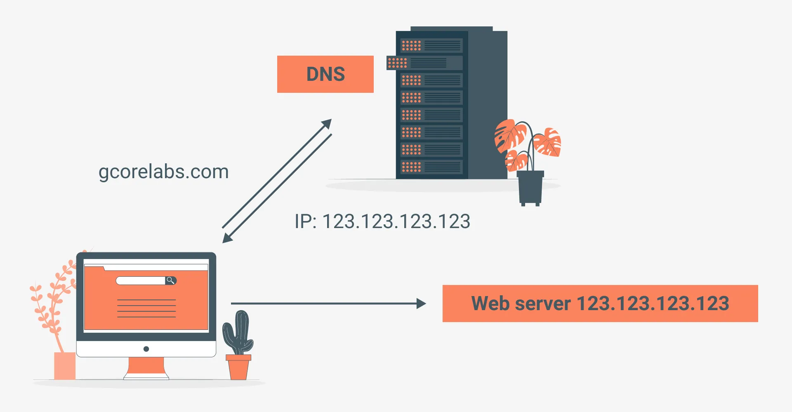
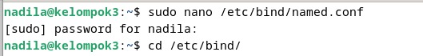
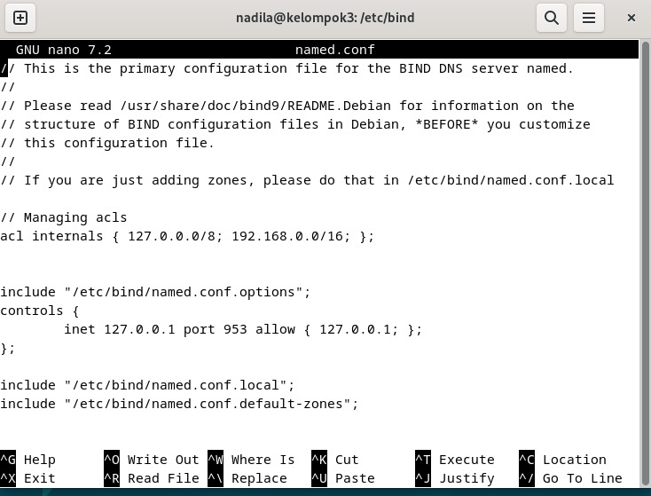
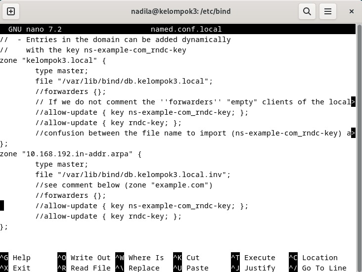
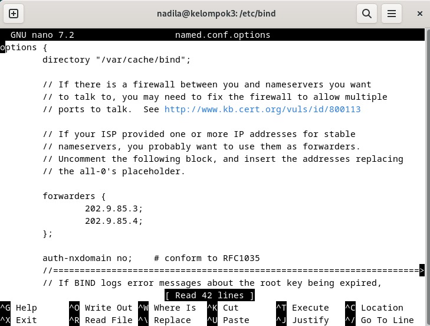
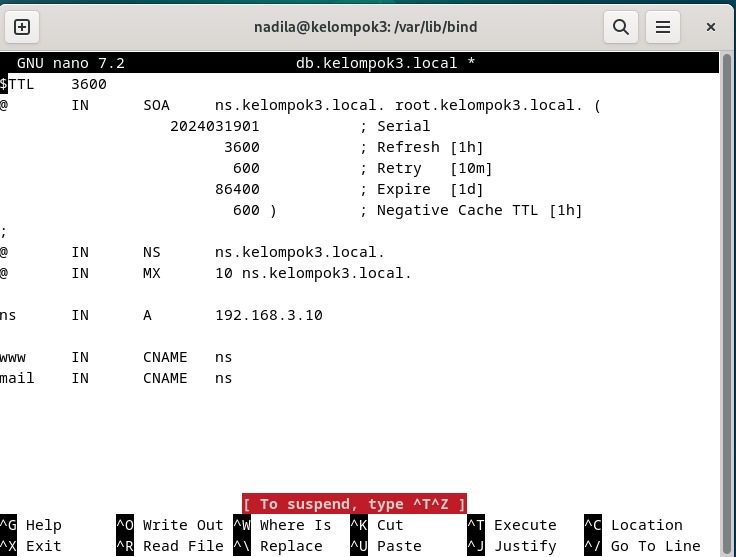
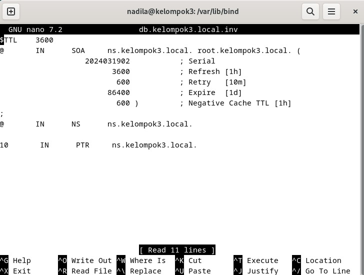

  <h1 style="text-align: center;font-weight: bold">Praktikum 4 Instalasi DNS Server</h1>
  <h4 style="text-align: center;">Dosen Pengampu : Dr. Ferry Astika Saputra, S.T., M.Sc.</h4>

 

  
  <h3 style="text-align: center;">Disusun Oleh : </h3>
  

    <strong>Nadila Aulya Salsabila Mirdianti</strong> 
    <strong>3122500002</strong>
  

<h3 style="text-align: center;line-height: 1.5">Politeknik Elektronika Negeri Surabaya Departemen Teknik Informatika Dan Komputer Program Studi Teknik Informatika 2023/2024</h3>
  

## Daftar Isi

- [Daftar Isi](#daftar-isi)
    - [A. Apa itu DNS Server?](#1-apa-itu-dns)
    - [B. Langkah Langkah](#2-langkah-langkah)

### A. Apa itu DNS?
**Pengertian DNS**

DNS adalah sebuah sistem yang menghubugkan Uniform Resource Locator (URL) dengan Internet Protocol Address atau IP Address. Kepanjangan dari DNS adalah Domain Name System.
 
Dalam sejarah domain tercatat, awalnya kita perlu mengetikkan IP Address untuk mengakses sebuah website. Cara ini cukup merepotkan.
 
Maka, ini artinya kita perlu punya daftar IP Address dari semua website yang ingin kita kunjungi dan memasukkannya secara manual. Tentu saja ini tidak efisien.
  
DNS adalah sistem yang memungkinkan kita untuk mengakses website dengan mengetikkan URL. DNS akan menghubungkan URL tersebut dengan IP Address yang sesuai.

### B. Langkah Langkah
Berikut adalah langkah-lang untuk instalasi DNS sever menggunakan BIND9 pada Debian 12:

#### 1. Konfigurasi file [named.conf](./bind9/named.conf)
lakukan configurasi pada file /etc/bind/named.conf dengan meggunakan perintah: `sudo nano /etc/bind/named.conf`
 
(Lihat file [named.conf](./bind9/named.conf))

     
    

 

#### 2. Konfigurasi file [named.conf.local](./bind9/named.conf.local)
Lakukan configurasi pada file /etc/bind/named.conf.local dengan menggunakan perintah: `sudo nano /etc/bind/named.conf.local`
 
(Lihat file [named.conf.local](./bind9/named.conf.local))

     

 

File `named.conf.local` mengatur zona-zona DNS lokal. Dalam konfigurasi ini, ada dua zona yang didefinisikan: "kelompok3.local" dan "3.168.192.in-addr.arpa". Server ditetapkan sebagai master untuk kedua zona tersebut. Informasi DNS disimpan dalam file database yang sesuai, dan konfigurasi juga memungkinkan pembaruan dinamis menggunakan kunci yang sesuai.

#### 3. Konfigurasi file [named.conf.option](./bind9/named.conf.options)
Lakukan configurasi pada file /etc/bind/[named.conf.option](./bind9/named.conf.options) dengan menggunakan perintah: `sudo nano /etc/bind/named.conf.options`

     

 

#### 4. Pengecekan Konfigurasi pada file [named.conf](./bind9/named.conf)
Lakukan pengecekan konfigurasi dengan menggunakan perintah: `sudo named-checkconf /etc/bind/named.conf`

     

 

#### 5. Buat file [db.kelompok3.local](./bind9/db.kelompok3.local)
Buat file zone /var/lib/bind/db.kelompok3.local yang digunakan untuk domain, dengan menggunakan perintah: `sudo nano /var/lib/bind/db.kelompok3.local`
 
(Lihat file [db.kelompok3.local](./bind9/db.kelompok3.local))

     

 

#### 6. Buat file db.kelompok3.local.inv
Buat file reverse zone /var/lib/bind/db.kelompok3.local.inv yang digunakan untuk reverse lookup, dengan menggunakan perintah: `sudo nano /var/lib/bind/db.kelompok3.local.inv`
 
(Lihat file [named.conf.inv](./bind9/named.conf.inv) dan sesuaikan)

     

 

#### 7. Restart service BIND
Lakukan restart service BIND dengan menggunakan perintah: `sudo systemctl restart named`

     

 

#### 8. Cek status service BIND
Lakukan pengecekan status service BIND dengan menggunakan perintah: `sudo systemctl status named`

     

 

#### 9. Check port 53
Check port 53 dengan menggunakan perintah: `sudo ss -tulnp` pastikan port 53 sudah terbuka 

     

 

#### 10. Konfigurasi file [resolv.conf](./bind9/resolv.conf)
Lakukan konfigurasi pada file /etc/resolv.conf dengan menggunakan perintah: `sudo nano /etc/resolv.conf`
 
(Lihat file [resolv.conf](./bind9/resolv.conf))

     

 

#### 11. Query DNS domain kelompok3.local
Lakukan query DNS domain kelompok3.local dengan menggunakan perintah: `dig kelompok3.local`

     

 

#### 12. Check nslookup
Lakukan pengecekan nslookup dengan menggunakan perintah: `nslookup kelompok3.local`

     

 

