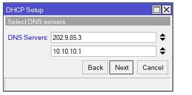

# Install Thunderbird

## 1. Update Debian 12
Sebelum install Thunderbird pastikan Debian 12 sudah diupdate
```sudo apt-get update && sudo apt-get upgrade -y```

## 2. Install Thunderbird
- Buka terminal kemudian jalankan command berikut untuk menginstall Thunderbird
  ```sudo apt install thunderbird```
- Kemudian konfirmasi instalasi dengan menekan tombol ```Y``` dan tekan enter untuk melanjutkan proses instalasi
- Thunderbird telah terinstall pada Debian 12

## 3. Konfigurasi Thunderbird
- Buka Thunderbird melalui pencarian aplikasi
- Setup akun email dengan mengisi kredential dengan alamat email dan password, kemudian klik ```Continue```
- Selanjutnya, akan muncul jendela konfigurasi. IMAP dipilih secara default sebagai protokol. Namun, kita juga bisa menggunakan POP3.
- Klik ```Done``` untuk menyelesaikan konfigurasi email

## 4. Mengubah Interface
Ubah interface thunderbird menjadi Attached to ```Bridge Adapter```


## 5. Menambahkan DNS
Untuk pengaturan IPv4 method pilih Manual, kemudian pada bagian DNS ubah menjadi ```10.10.10.1```


## 6. Forwarder dan Allow-query
Menambahkan forwarder dan merubah allow-query  dan allow-recursion menjadi ```any``` pada file named.conf.options
```sudo nano /etc/bind/named.conf.options```.


## 7. Merubah DNS
Merubah DNS Servers di mikrotik menjadi ```10.10.10.1```



## 7. Testing (Tambahan)
- Pengujian Web Server melalui client.
  

- Mencoba mengirim email ke alamat email lain.
  

- Melakukan pengecekan apakah dapat menerima email dari alamat lain.
  